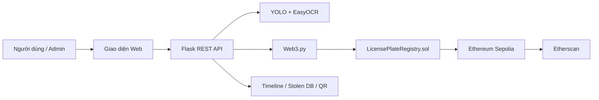

<h1 align="center">ỨNG DỤNG SMART CONTRACT TRONG QUẢN LÝ VÀ XÁC THỰC BIỂN SỐ XE</h1>

<div align="center">

<p align="center">
  
  
</p>

[](https://www.facebook.com/DNUAIoTLab)
[](https://fitdnu.net/)
[](https://dainam.edu.vn)

</div>

<div align="center">

**BlockPlate** là hệ thống quản lý và xác thực biển số xe bằng **Smart Contract**.  
OCR chỉ đóng vai trò hỗ trợ nhập nhanh biển số; dữ liệu xác thực cuối cùng được đối chiếu với smart contract trên **Ethereum Sepolia Testnet**.

[Poster](docs/Poster.pdf) · [Contract Sepolia](https://sepolia.etherscan.io/address/0x43a36498d0A7B929018e1f9ae56D65038fE790D2) · [Chạy thử](#chạy-web)

</div>

---

## Tổng quan

Trong bài toán quản lý biển số xe, các thao tác như đăng ký phương tiện, xác thực trạng thái, chuyển nhượng, khóa/mở khóa và ghi nhận vi phạm cần có tính minh bạch, có thể kiểm chứng và khó bị chỉnh sửa tùy tiện.

BlockPlate giải quyết vấn đề này bằng cách đưa dữ liệu cốt lõi lên smart contract. Người dùng thường có thể tra cứu, xác thực, sử dụng OCR hoặc webcam OCR; Admin phải xác thực bằng MetaMask trước khi thực hiện các thao tác quản trị.

> Trọng tâm của đề tài là **ứng dụng smart contract trong quản lý và xác thực biển số xe**. OCR là công cụ hỗ trợ giao diện, không phải nguồn xác thực chính.

---

## Trạng thái triển khai

| Hạng mục | Giá trị |
| --- | --- |
| Tên hệ thống | BlockPlate |
| Mạng blockchain | Sepolia Testnet |
| Contract hiện tại | `0x43a36498d0A7B929018e1f9ae56D65038fE790D2` |
| Explorer | [Xem trên Etherscan](https://sepolia.etherscan.io/address/0x43a36498d0A7B929018e1f9ae56D65038fE790D2) |
| File địa chỉ contract | `contracts/contract_address.json` |
| Backend | Flask, Web3.py |
| Frontend | HTML, CSS, JavaScript |
| Smart Contract | Solidity |
| Ví xác thực | MetaMask |
| Cập nhật gần nhất | 2026-06-04 |

---

## Chức năng chính

| Nhóm chức năng | Mô tả |
| --- | --- |
| Xác thực biển số | Tra cứu biển số đã đăng ký, trạng thái active/inactive và thông tin liên quan |
| Đăng ký phương tiện | Admin đăng ký biển số mới lên smart contract |
| Cập nhật phương tiện | Admin cập nhật loại xe, màu xe và tỉnh/thành phố |
| Chuyển nhượng | Ghi nhận chuyển chủ sở hữu phương tiện |
| Khóa / mở khóa | Chuyển trạng thái biển số giữa active và inactive |
| Vi phạm | Ghi nhận lỗi vi phạm và đánh dấu đã nộp phạt |
| Xe mất cắp | Báo mất xe và liên kết khóa phương tiện trên blockchain |
| Timeline | Theo dõi giao dịch đăng ký, cập nhật, chuyển nhượng, vi phạm, khóa/mở khóa |
| QR xác minh | Admin tạo QR có hỗ trợ tiếng Việt; người dùng quét QR để kiểm tra |
| OCR hỗ trợ | Upload ảnh hoặc dùng webcam OCR để lấy biển số đề xuất |

---

## Phân quyền hệ thống

| Chức năng | Người dùng thường | Admin |
| --- | :---: | :---: |
| Xem dashboard công khai | Có | Có |
| Tra cứu / xác thực nhanh | Có | Có |
| Upload ảnh OCR | Có | Có |
| Webcam OCR | Có | Có |
| Xem timeline công khai | Có | Có |
| Xem danh sách xe mất cắp | Có | Có |
| Đăng ký biển số mới | Không | Có |
| Cập nhật thông tin phương tiện | Không | Có |
| Chuyển nhượng chủ sở hữu | Không | Có |
| Khóa / mở khóa phương tiện | Không | Có |
| Ghi nhận vi phạm | Không | Có |
| Đánh dấu vi phạm đã nộp phạt | Không | Có |
| Xem thông tin chi tiết chủ xe | Bị che một phần | Có |

Admin đăng nhập bằng MetaMask thông qua cơ chế ký thông điệp xác thực. Backend kiểm tra token Admin cho mọi API thay đổi dữ liệu, nên chỉ kết nối ví thông thường sẽ không tự có quyền quản trị.

---

## Kiến trúc hệ thống



### Vai trò từng lớp

| Thành phần | Vai trò |
| --- | --- |
| Frontend | Hiển thị giao diện, phân quyền theo trạng thái Admin, hỗ trợ upload/webcam OCR |
| Flask API | Xử lý request, chuẩn hóa biển số, kiểm tra quyền Admin, gọi OCR và blockchain |
| Smart Contract | Lưu dữ liệu biển số, trạng thái, vi phạm, chuyển nhượng và sự kiện on-chain |
| MetaMask | Xác thực Admin và kết nối ví trên Sepolia |
| Etherscan | Đối chiếu giao dịch và contract đã deploy |

---

## Smart Contract

Contract chính nằm tại:

```text
contracts/LicensePlateRegistry.sol
```

Các hàm quan trọng:

| Hàm | Ý nghĩa |
| --- | --- |
| `registerPlate(...)` | Đăng ký biển số mới |
| `verifyPlate(...)` | Xác thực biển số |
| `getPlateInfo(...)` | Lấy thông tin phương tiện |
| `updateVehicle(...)` | Cập nhật loại xe, màu xe, tỉnh/thành phố |
| `transferOwnership(...)` | Chuyển nhượng chủ sở hữu |
| `deactivatePlate(...)` | Khóa hoặc vô hiệu hóa phương tiện |
| `reactivatePlate(...)` | Mở khóa hoặc kích hoạt lại phương tiện |
| `addViolation(...)` | Ghi nhận vi phạm giao thông |
| `markViolationPaid(...)` | Đánh dấu vi phạm đã nộp phạt |
| `getViolations(...)` | Lấy danh sách vi phạm |

`reactivatePlate()` không tạo biển số mới và không xóa dữ liệu cũ. Hàm này chỉ chuyển biển số đã tồn tại từ trạng thái inactive về active.

---

## Chuẩn hóa biển số

Hệ thống chuẩn hóa biển số trước khi ghi hoặc tra cứu blockchain để tránh sai lệch do cách nhập khác nhau.

Ví dụ các dạng sau được xử lý về cùng một khóa tra cứu:

```text
59T160574
59-T1-60574
59-T1-605.74
```

Kết quả chuẩn hóa:

```text
59-T1-605.74
```

---

## OCR và xác thực blockchain

OCR có thể đọc sai khi ảnh mờ, thiếu sáng, bị nghiêng, chụp qua màn hình điện thoại, biển hai dòng hoặc ký tự nhỏ. Vì vậy hệ thống được thiết kế theo nguyên tắc:

- OCR chỉ tạo **biển số đề xuất**.
- Người dùng có thể kiểm tra hoặc sửa lại biển trước khi xác thực.
- Blockchain mới là nguồn dữ liệu xác thực cuối cùng.
- Nếu OCR không khớp định dạng biển số Việt Nam, hệ thống hạ độ tin cậy và yêu cầu xác nhận.

---

## Cài đặt

Yêu cầu:

- Python 3.10 trở lên
- MetaMask
- Tài khoản Sepolia có SepoliaETH nếu cần gửi giao dịch
- VS Code hoặc terminal bất kỳ

Cài môi trường:

```powershell
cd D:\BlockChain
python -m venv .venv
.\.venv\Scripts\Activate.ps1
pip install -r requirements.txt
```

Tạo file cấu hình:

```powershell
Copy-Item .env.example .env
```

Sau đó điền các biến cần thiết trong `.env`, đặc biệt:

```text
PRIVATE_KEY=
ADMIN_ADDRESS=
ADMIN_TOKEN_SECRET=
SEPOLIA_RPC_URL=
```

Không commit `.env`, private key hoặc secret token lên GitHub.

---

## Chạy web

Chạy ứng dụng:

```powershell
cd D:\BlockChain
.\.venv\Scripts\Activate.ps1
python web_app.py
```

Mở trình duyệt tại:

```text
http://127.0.0.1:5000
```

Nếu contract đã deploy và `contracts/contract_address.json` đang trỏ đúng địa chỉ, bạn không cần Remix IDE để chạy web. VS Code + terminal là đủ.

---

## Compile và deploy contract

Không cần compile/deploy lại nếu chỉ sửa:

- Giao diện
- OCR
- Flask API
- README
- File tĩnh trong `static/` hoặc `templates/`

Chỉ compile/deploy lại khi sửa file:

```text
contracts/LicensePlateRegistry.sol
```

Lệnh compile/deploy:

```powershell
python compile_contract.py
python deploy_contract.py
```

Deploy mới sẽ tạo contract address mới. Sau khi deploy cần kiểm tra:

```text
contracts/contract_address.json
```

Có thể deploy contract trắng không migrate dữ liệu cũ bằng:

```powershell
python deploy_contract.py --no-migrate
```

---

## Luồng demo đề xuất

1. Mở Dashboard và giới thiệu các thống kê công khai.
2. Tra cứu nhanh một biển số đã đăng ký.
3. Upload ảnh hoặc dùng Webcam OCR để lấy biển số đề xuất.
4. Nhấn mạnh OCR chỉ là hỗ trợ, người dùng có thể sửa biển trước khi xác thực.
5. Đăng nhập Admin bằng MetaMask và ký thông điệp xác thực.
6. Đăng ký một biển số mới lên blockchain.
7. Mở Timeline để xem giao dịch vừa phát sinh.
8. Cập nhật thông tin phương tiện hoặc chuyển nhượng chủ sở hữu.
9. Ghi nhận vi phạm và đánh dấu đã nộp phạt.
10. Báo mất xe, khóa phương tiện, sau đó mở khóa lại.
11. Đăng xuất Admin và kiểm tra các chức năng quản trị đã bị ẩn.

---

## Kiểm thử

Chạy smoke test API:

```powershell
python scripts/smoke_test_app.py
```

Các nhóm test chính:

- Health check
- Kết nối blockchain
- Phân quyền Admin
- API tra cứu biển số
- API đăng ký/cập nhật/chuyển nhượng/khóa/mở khóa
- Timeline
- Xe mất cắp
- QR code
- OCR endpoint

---

## Cấu trúc thư mục

```text
D:\BlockChain
|-- web_app.py                         # Flask web app và REST API
|-- inference.py                       # Pipeline OCR/detect biển số
|-- video_recognition.py               # Xử lý video/webcam
|-- blockchain_service.py              # Giao tiếp smart contract
|-- blockchain_config.py               # Cấu hình RPC, ví, contract
|-- blockchain_timeline.py             # Timeline giao dịch nội bộ
|-- stolen_vehicles.py                 # Quản lý xe mất cắp
|-- qr_generator.py                    # Tạo/đọc QR xác minh
|-- compile_contract.py                # Compile Solidity contract
|-- deploy_contract.py                 # Deploy contract lên Sepolia
|-- contracts/
|   |-- LicensePlateRegistry.sol
|   |-- LicensePlateRegistry_abi.json
|   |-- LicensePlateRegistry_bytecode.json
|   |-- contract_address.json
|-- static/
|   |-- app.js
|   |-- style.css
|-- templates/
|   |-- index.html
|-- scripts/
|   |-- smoke_test_app.py
|-- docs/
|   |-- Poster.png
|   |-- Poster.pdf
|-- models/
|-- dataset_final/
|-- uploads/
|-- results/
|-- qr_codes/
```

---

## Dữ liệu runtime

Các thư mục/file sau được sinh ra khi chạy app:

| Đường dẫn | Vai trò |
| --- | --- |
| `uploads/` | Ảnh/video người dùng tải lên |
| `results/` | Ảnh kết quả đã vẽ box OCR |
| `qr_codes/` | QR xác minh được tạo |
| `blockchain_timeline.json` | Timeline local hỗ trợ giao diện |
| `stolen_vehicles.json` | Dữ liệu xe mất cắp local |

Không xóa các dữ liệu này khi đang chuẩn bị demo, trừ khi muốn reset dữ liệu chạy thử.

---

## Troubleshooting

| Lỗi | Cách xử lý |
| --- | --- |
| Không mở được web | Kiểm tra `python web_app.py` đang chạy và port 5000 chưa bị chiếm |
| MetaMask offline | Chọn đúng Sepolia, reload trang, kết nối lại ví |
| Wallet is not the contract admin | Dùng đúng ví Admin hoặc chỉ thao tác chức năng người dùng |
| Admin token expired | Đăng nhập Admin lại bằng MetaMask |
| Contract không có dữ liệu | Kiểm tra `contracts/contract_address.json` |
| Giao dịch thất bại | Kiểm tra SepoliaETH, mạng Sepolia và ví ký giao dịch |
| OCR sai nhưng confidence cao | Xem OCR là gợi ý, sửa tay trước khi xác thực blockchain |
| QR không tạo được | Kiểm tra dependency `qrcode` và `pillow` trong `requirements.txt` |

---

## Ghi chú bảo mật

- Không đưa private key vào README, ảnh chụp màn hình hoặc commit.
- `.env` phải được giữ ở local và không đưa lên GitHub.
- Kiểm tra đúng mạng Sepolia trước khi gửi giao dịch.
- Frontend/backend đã che tên chủ xe với người dùng thường.
- Vì Sepolia là blockchain công khai, dữ liệu ghi trực tiếp lên chain vẫn có thể được đọc bằng công cụ blockchain. Nếu muốn bảo mật dữ liệu cá nhân tốt hơn, nên lưu hash hoặc mã tham chiếu on-chain và giữ dữ liệu chi tiết ở hệ thống off-chain có phân quyền.

---

## Poster

<p align="center">
  
</p>

<p align="center">
  <a href="docs/Poster.pdf"><b>Xem hoặc tải Poster PDF</b></a>
</p>
